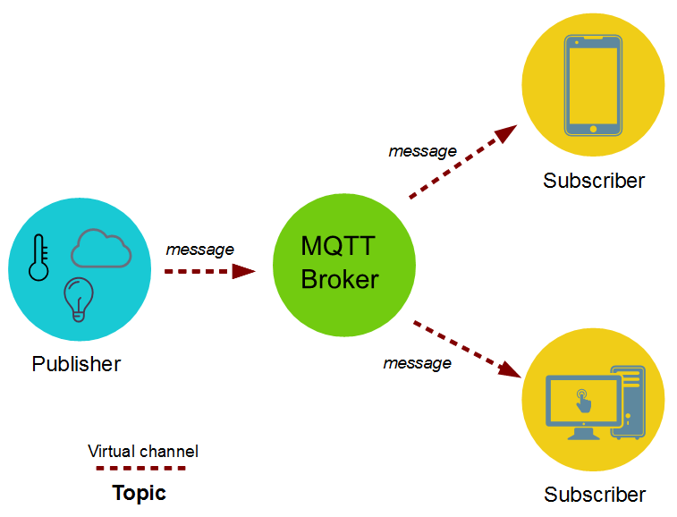

## What is MQTT

MQTT stands for `Message Queuing Telemetry Transport Protocol`

MQTT is an open OASIS and ISO standard lightweight, publish-subscribe application level network protocol that transports messages between devices. It is designed for M2M (machine to machine) telemetry in low bandwidth environments.

The protocol usually runs over TCP/IP. It is designed for connections with remote locations where a "small code footprint" is required or the network bandwidth is limited.

MQTT uses Transport Layer Security (TLS) encryption with username, password protected connections and or Certificates.

## MQTT History
It was designed by Andy Stanford-Clark (IBM) and Arlen Nipper in 1999 for connecting Oil Pipeline telemetry systems over satellite.

It was released Royalty free in 2010 and became an OASIS standard in 2014.

## MQTT Features
- OASIS and ISO standard
- Lightweight
- Application layer protocol, just like HTTP, HTTPS
- Small code footprint
- Runs over TCP/IP for reliability, UDP also possible
- Designed for M2M (machine to machine) telemetry
- Used in low bandwidth environments

## MQTT Versions
- MQTT v3.1.0
- MQTT v3.1.1 
- MQTT v5
- MQTT-SN: was specified in around 2013, and designed to work over UDP, ZigBee and other transports.

## MQTT Architecture

### MQTT Broker (Server)

MQTT Broker or server is a Software entitity runing on a machine (on premise or in the cloud) which acts as a post office for the clients, who can participate in the messaging using pub (publish) / sub (subscribe) messages.

The main advantages of MQTT broker are:
- Eliminates vulnerable and insecure client connections
- Can easily scale from a single device to thousands
- Manages and tracks all client connection states, including security credentials and certificates
- Reduced network strain without compromising the security

### MQTT Client

`MQTT Client` is a Software entitity usually runing on a small sensor node which can participate in the messaging with MQTT Broker or other MQTT clients using pub (publish) / sub (subscribe) messages.

### MQTT Topic

A Topic eg 'Temperature' which the Clients can pub and sub to.

### MQTT Messages

#### CONNECT and CONNACK

Establish connection with the MQTT server and creates a link between the nodes.

#### DISCONNECT

Close connection with the MQTT server and destroy a link between the nodes.

#### PUBLISH and SUBSCRIBE

Clients can subscribe to a topic with the Server (Broker) via `SUBSCRIBE` message.

Clients can publish to a topic with the Server (Broker) via `PUBLISH` message.

### MQTT Quality of service (QoS)

Following QoS parameters are defined in MQTT

- At most once (fire and forget)
The message is sent only once and the client and broker take no additional steps to acknowledge delivery.

- At least once (acknowledged delivery)
The message is re-tried by the sender multiple times until acknowledgement is received.

- Exactly once (assured delivery)
the sender and receiver engage in a two-level handshake to ensure only one copy of the message is received.

